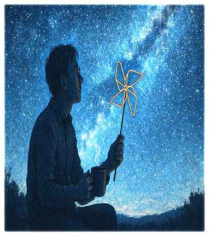

# 科學家的「本日公休」

一份介於科學、教育、研究生活與文學之間的作品集。

> 部分作品依原簡報保留中英文對照；原簡報中的作品插圖也已整理至各篇文章。

這裡收錄原先整理於《最終的謎題》的散文、研究札記與現代詩。作品常以物理、研究方法、教育、學術倫理與日常經驗互相轉譯。

## 散文
- [研究日誌（緣起）](essays/01-research-journal.md) — 中英
- [職場文化與防火牆](essays/02-workplace-culture-and-firewall.md) — 中英
- [教材](essays/03-teaching-materials.md) — 中英
- [教育的座標系假說](essays/04-educational-coordinate-system.md) — 中英
- [SpecKit 緣起](essays/05-speckit-origin.md) — 中英
- [學術倫理](essays/06-research-ethics.md) — 中英
- [老師](essays/07-teacher.md) — 中英
- [研究與轉譯](essays/08-research-and-translation.md)
- [同行審查](essays/09-peer-review.md) — 中英

## 現代詩
- [教育精神的詩意序曲](poems/01-educational-spirit.md) — 中英
- [光與科學希望的敘事序曲](poems/02-light-and-hope-of-science.md) — 中英
- [科學證據與中子活化的詩意序曲](poems/03-scientific-evidence-and-neutron-activation.md) — 中英
- [中子照相的詩意序曲](poems/04-neutron-imaging.md) — 中英
- [科學搖滾的詩意序曲](poems/05-science-rock.md) — 中英
- [童話與安全度評估的詩意序曲](poems/06-fairy-tales-and-safety-assessment.md) — 中英
- [紅葉・落花](poems/07-red-leaves-and-fallen-flowers.md)
- [不可說](poems/08-unspeakable.md)
- [禁止進入](poems/09-no-entry.md)
- [林間雨](poems/10-forest-rain.md)
- [羽織](poems/11-haori.md)

---

> 科學與人文從來不是二元對立的。

## 版本說明
此 repository 以 Markdown 保存作品，方便閱讀與版本追蹤。原簡報中已有的英文版本與作品插圖已盡量依原稿配回對應篇章；原稿沒有英文版本的作品則保留中文，不另外增譯。個別註釋也依簡報內容保留。

## Copyright
除另有標示外，作品著作權歸原作者所有。未經授權請勿重製、改作或商業使用。
