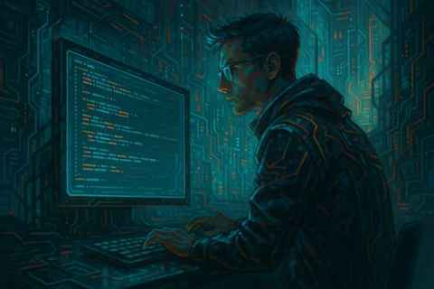

# SpecKit緣起

這個軟體的由來，是因為我們機關正好要發展中子科學，需要一套方法來檢驗中子射束的品質——包含能譜形狀和通量。

計畫主持人聊到這個需求的時候，我當然自動請纓包下來，因為這是個我在教科書上看過，但沒有機會可以實做的題目，我有七八成把握可以搞定。我處理演算法，計畫主持人則處理實驗室的實驗設計與實作，由於中子活化是我的專長，在實驗設計上，比如需要多少活化材料的質量建議，我也多少可以幫上忙，當然對方也會提供我一些ASTM標準，一起討論和選定材料。這是個有趣的過程，充分滿足了我的求知與創作慾。而且我又是個熱愛分享的人，總喜歡在開會的時候將如何使用中子活化來反推能譜的原理、演算法設計、難處等等，鉅細靡遺地托出，但問題很快就出現了：在這個「人人都可以寫程式的時代」，對方很快就寫了一版看起來堪用的程式，我在計畫中的角色瞬間被邊緣化。

這是做計算科學的人員，在和實驗方合作時，常會遇到的狀況，可以預想這種狀況在AI盛行的現代將愈發嚴重。這導致兩個可以思考的問題(A) 研究上或工作上，如何創造對雙方有利的合作？ (B)在目前AI盛行的時代，對教育或技能的取得，究竟有何影響？

事情總是沒有標準答案，只能盡可能地、誠懇地解決，對方設計的程式讓我在情感上感到不適，在理性上感到為難。情感不適映射了(A)問題，而理性上的為難則映射到了(B)問題，但我相信對方並沒有惡意。我只好重新和計畫主持人談了一遍工作邊界，並且盡快地將我個人的程式整理發表。當然發表前我審慎地、再三地考慮過學術倫理問題，在確認研究構想與設計、資料收集與分析、理論與詮釋等都由我一個人完成，才選擇以獨立作者的身分發表了這一個研究工具軟體(當然有告知計畫主持人)，除此之外，我自己付了OA(Open Access)費。這絕對不是最好的解決方式，事實上在現實生活中，唯一解是不存在的，基本上就是在時間、金錢、倫理上，選擇一個個人可以接受的最佳解，並且要認清楚：凡事均有代價。

而AI對於教育會產生怎樣的影響？這可能是一個更「棘手」的討論，以這個經驗來說，平實而論，對方寫了一版表面上非常漂亮的程式，但在科學論證很難站得住腳，但我很難和對方理性討論應該如何檢驗與論證，因為這既不是我的工作，也不是我的義務，並且對方也不見得聽得下去。知識的學習需要一連串的進度與節奏，這些是需要經過設計的，我們可以在教科書中、課堂中看到這樣的設計脈絡，但卻很難在AI上看到，這是由於AI的回應是基於使用者的提問，但一個正在學習的人，可能很難有脈絡地意識並提出問題。

---

## English — The Origin of SpecKit

The origin of this software lies in our institute’s plan to develop neutron science. We needed a way to assess neutron beam quality—its energy spectrum and flux.

When the project leader mentioned this need, I immediately volunteered. It was a topic I had only seen in textbooks but never had the chance to implement. I was about 70–80% confident I could handle it. I worked on the algorithms while the project leader managed the experiments. Since neutron activation is my specialty, I could also advise on material mass and selection based on ASTM standards. It was a fascinating process that fully satisfied my curiosity and creative urge. Being a person who loves sharing, I eagerly explained every detail in meetings—the principles of deriving spectra through neutron activation, the algorithm design, and the difficulties involved. But soon, a problem arose. In this “everyone can code” era, my collaborator quickly produced a functional version of the program. Suddenly, my role in the project became marginal.

This is a common situation for computational scientists working with experimental teams—and it’s likely to worsen in the age of AI. It raises two questions:

(A) How can we create truly collaborative research relationships?  
(B) How does the rise of AI affect education and skill development?

There are no fixed answers—only the most honest solutions we can manage. The collaborator’s code made me uncomfortable emotionally (reflecting question A) and uneasy rationally (reflecting question B), though I knew there was no ill intent. I renegotiated our roles and quickly prepared my own version of the software for publication. After carefully reviewing ethical considerations—confirming that the research idea, design, data collection, analysis, and interpretation were all my own—I decided to publish as a sole author, informing the project leader and paying the Open Access fee myself. It was not the perfect solution, but in reality, no perfect one exists. Every decision carries its cost—in time, money, or ethics.

As for AI’s impact on education, this experience highlights a difficult truth. My collaborator’s program looked impressive but lacked scientific rigor. Yet, it was hard to discuss validation or reasoning—it wasn’t my duty, and they might not have been willing to listen. Learning requires a structured process, one designed with rhythm and progression. Textbooks and classrooms provide such scaffolding, but AI does not—it responds only to questions. And a learner, still unaware of what they don’t yet know, may struggle even to ask the right ones.
