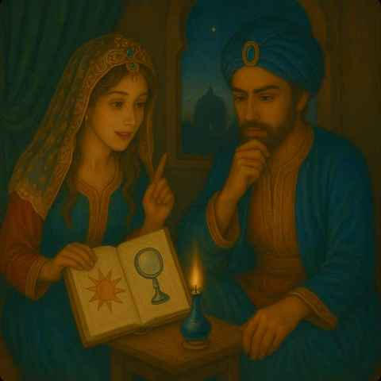

# 光與科學希望的敘事序曲

> 「對人類本身及其命運的關懷，  
> 必須永遠是所有技術努力的首要考量」  
> — Albert Einstein

暴怒的國王下令，  
每天迎娶一位女子，  
卻從不讓她活過黎明，  
因為他不相信科學。  

他不相信科學可以解決飢荒、  
守護家園、  
如魔法般地凝聚能量。  

若世界果真按照規律優雅地運行，  
為何他的心靈還會如此空虛殘缺？  

於是Scheherazade（山魯佐德），  
向國王說了Fritz Haber從空氣中提取肥料的故事，  
說了Archimedes利用曲光鏡擊退敵人的故事，  
噓，仔細聽，  
她正要從Archimedes的光線聚焦方法，  
說到如何選取中子波長呢！  

一位溫柔的時光敘述者，  
他正要告訴你的，  
是關於科學的，  
一千零一夜的故事……。

## 註釋

*1：1909 年，Haber 發明了「哈伯法」（Haber process），可以從空氣中的氮氣與另行供應的氫氣合成氨。這讓人類能大量生產人工氮肥（氨→硝酸鹽），這項技術大幅提升農業產量，被認為救活了數以億計的人。然而，同樣的化學技術後來也被用在戰爭上。氨可以轉化成硝酸，再製成炸藥；Haber 本人在第一次世界大戰期間更主持了毒氣武器的開發與實戰使用。於是，他既被稱為「餵飽世界的人」，也被譏為「毒氣之父」。

*2：傳說中，阿基米德（Archimedes）在西元前 3 世紀敘拉古被羅馬軍圍攻時，利用曲光鏡（拋物面鏡）或銅盾反射陽光，將陽光集中到敵方船隻上，點燃船帆或木材，成功擊退敵軍。這個故事後來被稱為「阿基米德熱射線武器」或「阿基米德燃燒鏡」。現代科學家多半認為這只是傳說。

*3：當一束中子通過晶體時，晶體內整齊排列的原子層會像鏡面一樣，把中子波反射出去。不過，只有某些特定波長的中子，會因為反射後波峰與波峰相疊（產生「建設性干涉」），形成明顯的反射；其他波長則會互相抵消而消失。因此，只要改變晶體與中子束之間的角度，就能控制哪些波長的中子被反射出來。這個原理被應用在中子實驗儀器中，用晶體作為「單色器」，挑出需要的單一波長中子束來進行測量。

---

## English — A Narrative Prelude on Light and the Hope of Science

> “Concern for man himself and his fate  
> must always form the chief interest of all technical endeavors”  
> — Albert Einstein

In a fury, the king decreed  
that each dawn he would marry a new bride,  
only to let none survive past morning,  
for he did not believe in science.  

He did not believe  
that science could solve famine,  
ensure the safety of his people,  
or gather energy as if by magic.  

If the world truly ran  
in graceful accordance with natural laws,  
why then was his soul so hollow, so broken?  

So Scheherazade  
told the king the story of Fritz Haber,  
who drew fertilizer from the air,  
and the tale of Archimedes,  
who held off invaders with sunlight curved by mirrors.  

Shh… listen closely.  
She was just about to explain  
how Archimedes’ method of focusing sunlight  
relates to the selection of neutron wavelengths.  

A gentle narrator of time  
is about to tell you  
a story of science—  
a tale from the Thousand and One Nights...

### Notes

*1: In 1909, Fritz Haber invented the Haber process, which synthesizes ammonia from nitrogen from the air and separately supplied hydrogen. This allowed humans to mass-produce artificial nitrogen fertilizer (ammonia → nitrate), greatly increasing agricultural yields and saving hundreds of millions of lives. However, the same chemical technology was later applied to warfare. Ammonia can be converted into nitric acid and then into explosives; during World War I, Haber himself led the development and battlefield use of chemical weapons. As a result, he was called both “the man who fed the world” and “the father of chemical warfare.”

*2: According to legend, Archimedes, during the 3rd century BCE siege of Syracuse by the Romans, used curved mirrors (parabolic mirrors) or polished bronze shields to reflect sunlight onto enemy ships, concentrating the light to ignite their sails or wooden hulls and repel the attack. This story later became known as the “Archimedes heat ray” or “burning mirror.” Modern scientists generally believe this story is a myth.

*3: When a beam of neutrons passes through a crystal, the regularly arranged atomic planes act like mirrors that reflect the neutron waves. However, only neutrons of certain wavelengths experience constructive interference—where reflected waves reinforce each other—producing strong reflection; other wavelengths cancel out. Therefore, by adjusting the angle between the crystal and the neutron beam, one can control which wavelengths are reflected. This principle is used in neutron instruments, where crystals serve as monochromators to select a single neutron wavelength for measurement.
