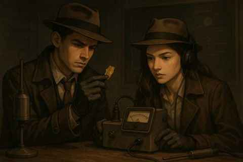

# 科學證據與中子活化的詩意序曲

> “非凡的主張需要非凡的證據。”  
> ―Carl Sagan

無法進入的現場  
聞名遐邇卻素未謀面的對手  
以及隨著時間消逝的證據  

密室之中  
一場鬥智遊戲即將開始  

一定發生了甚麼  
蓋格計數器的警告  
越來越急促  

那個不帶電的粒子必定來過  
留下了一些蛛絲馬跡  
手法如此高明  
你只在教科書中見過  

Science Holmes  
你小心翼翼地從現場撿起一片金箔  

“中子，我抓到你了”，你說  

你的耳機裡，正響起Michael Jackson的成名歌曲――  
Smooth Criminal……

---

## English — A Poetic Prelude to Scientific Evidence and Neutron Activation

> “Extraordinary claims require extraordinary evidence.”  
> — Carl Sagan

An inaccessible scene  
A famed yet unseen rival  
Evidence fading with time  

Inside a sealed chamber,  
a battle of wits is about to begin.  

Something has surely happened.  
The Geiger counter’s warning  
grows ever more urgent.  

That uncharged particle must have slipped through,  
leaving behind a few traces—  
so deftly done,  
you’ve only ever seen such methods in textbooks.  

Science Holmes,  
you carefully pick up a piece of gold foil from the scene.  

“Neutron, I’ve caught you,” you say.  

In your earphones, at that very moment,  
plays Michael Jackson’s famous song—  
Smooth Criminal…
