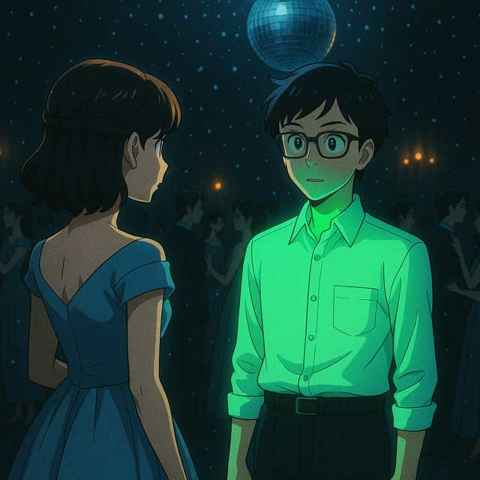

# 中子照相的詩意序曲

> “如果宇宙不是你所愛之人的家園，  
> 那這個宇宙也沒什麼值得探求的”  
> ——Stephen Hawking

1962年的新年  
他穿了一件能在黑暗下發出螢光的襯衫  
當室內燈光退去  
在迪斯可球灑下的雪花中  
他成了全場唯一發光的人――  
只為了讓Jane的目光  
穿過重重人群發現他  

間接的間接  
證據的證據  
總有一些難以觀測的  
在科學間流動  

但我想我們仍舊可以  
捕捉到一些甚麼  

2025年的夏天  
中子打在閃爍體上發出的螢光  
經過折射鏡，到達了數位相機的感光器  
然後擊中了63年後  
另一個被科學微光吸引的靈魂

---

## English — A Poetic Prelude to Neutron Imaging

> “It would not be much of a universe  
> if it wasn't home to the people you love.”  
> ——Stephen Hawking

New Year’s Day, 1962,  
he wore a suit that glowed in the dark.  
When the lights indoors faded away,  
beneath the snowfall of the disco ball,  
he became the only one shining in the crowd—  
just so that Jane's gaze  
could cut through the sea of people to find him.  

The indirect of the indirect,  
the evidence of the evidence—  
there are always traces beyond direct observation  
that flow quietly within science.  

Yet I believe we can still  
capture something.  

Summer, 2025  
Neutrons strike a scintillator, producing a faint glow  
that, through a refractive mirror, reaches  
the image sensor of a digital camera  
and then, 63 years later, strikes  
another soul drawn to the faintest light.
