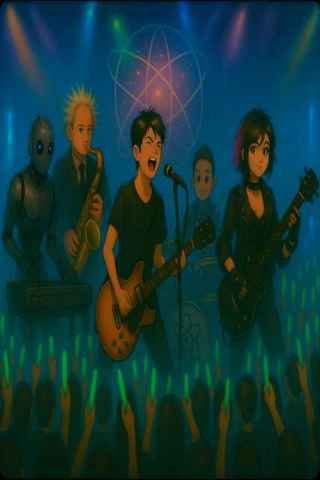

# 科學搖滾的詩意序曲

> 沒有孤立的證據，證據的力量來自其與其他證據的關聯  
> — Rudolf von Jhering(1818–1892)，德國法學家

週邊交通已被管制  
今天正適合瘋狂搖滾  

團員都到齊了嗎？  
各就各位吧！  

安卓負責電子混音  
質量守恆控管現場  
貝斯是蒙地卡羅  
EL效應hold住舞台燈光  

穩住你的心臟，數學鼓手  
快看觀眾席上跳動發光的電子海洋  
那是對震撼靈魂的渴望  

倒數計時！Go！  
該上場了，吉他手  
這就是我最愛的物理主唱  

科學研究  
現正流行混搭風

---

## English — A Poetic Prelude of Science Rock

> “There is no isolated evidence;  
> the power of evidence lies in its connection with other evidence.”  
> — Rudolf von Jhering (1818–1892), German jurist

The streets are sealed off,  
today is made for reckless rock.  

Are all the band members here?  
Take your places!  

Android on electronic remix,  
Conservation of Mass controls the scene,  
Monte Carlo thunders on the bass,  
EL Effect holds the stage lights steady.  

Hold the beat of your heart—  
the drummer is Mathematics itself.  

Look out at the glowing ocean of electrons  
leaping in the crowd—  
that is the hunger for soul-shaking sound.  

Countdown begins—Go!  
Step up, guitarist,  
for here comes my favorite lead singer: Physics.  

Scientific research,  
a remix in the wild style of discovery.
