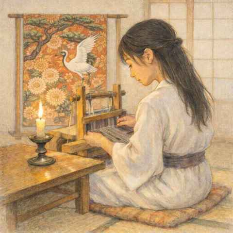

# 羽織

> 不寫情詞不寫詩，一方素帕寄心知  
> ─明・佚名

幽微的燭光  
透過和室的紙門  
靜靜暈了開來  

門裡門外  
便隔成兩道無法相知的世界  

閉上眼  
切莫探尋那些關於我的  
浮光掠影的涵義吧  

你若是仔細探究  
那無法訴說的情感  
便只能化作一道驚鴻消散  

也請莫要詢問  
就這樣讓我  
將自己禁錮吧  

放任我想像門後的你  
靜默的唇和心跳  

我便將一身彩羽  
織成錦繡文字  
予你做冬衣  

20260120
